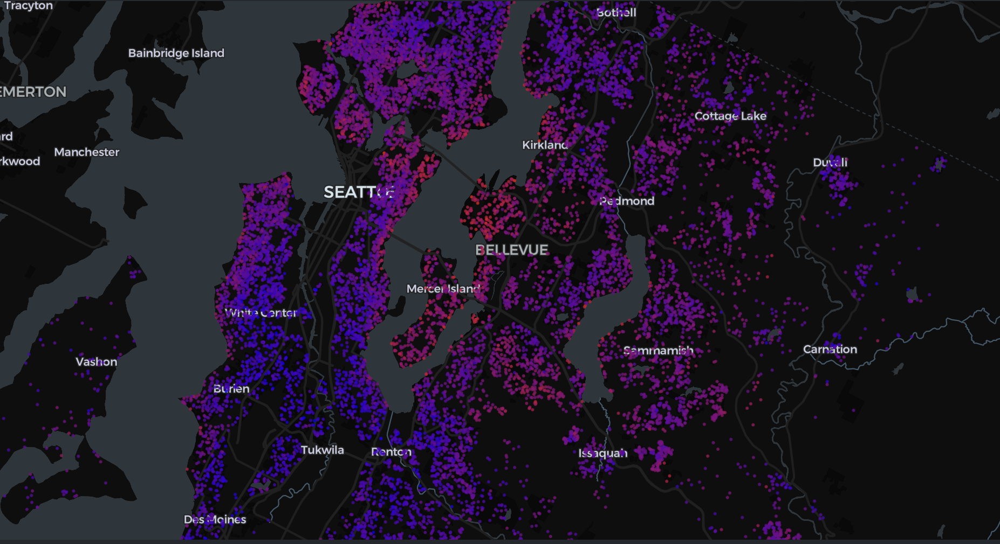

# 🏠 Real Estate Price Prediction: King's County 

This repository contains codes for the second milestone of the Course, namely leveraging XAI framework within the scope of house sale price prediction.



## 📁 Project Structure

- `data/`: Stores both raw and external data together with processed versions after transformations.
- `notebooks/`: Contains Jupyter notebooks with data analysis and model development steps.
- `source/`: Holds modular Python code with functions and objects.
- `models/`: Save trained models and any exported files (e.g., `.pkl`, `.joblib`).
- `requirements.txt`: Used to set up the project environment.
- `README.md`: Overview, setup guide, and usage instructions.


## 🔧 Setup Instructions

Assuming that you have already cloned the repository and are currently in WNE-XAI-2025/ folder:

1. Make sure you are in project folder `03_regression`:
```bash 
cd 03_regression
```

2. Create a new conda environment: 
```bash 
conda create -n xai-env-2026 python=3.12
```

3. Activate the environment: 
```bash
conda activate xai-env-2026
```

4. pip install -r requirements.txt
```bash 
pip install -r requirements.txt
```

## 📌 Author
Irena Zimovska
[i.zimovska@uw.edu.pl]
