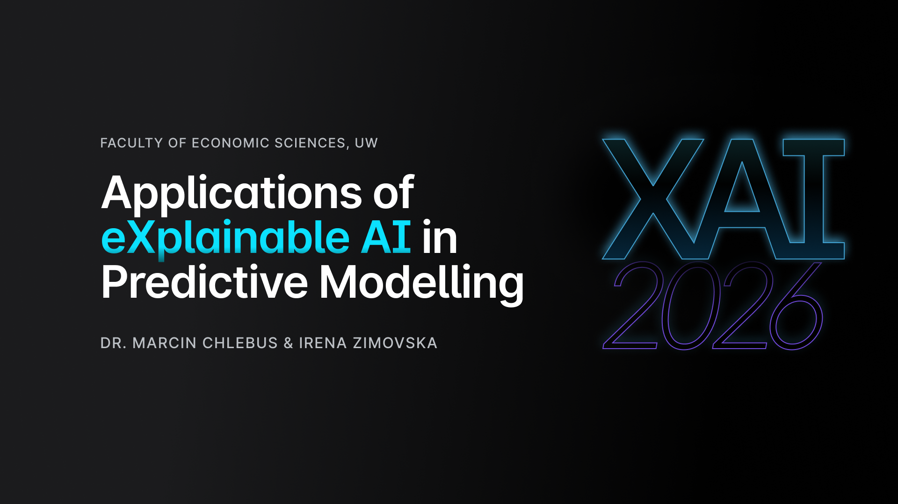

# Welcome to XAI-2026 course!
This repository contains materials for the XAI elective course conducted at the University of Warsaw, Faculty of Economic Sciences in academic year 2025/2026.

## Short course summary
The purpose of the course is to familiarize students with the principles and applications of Explainable AI (XAI) in Machine Learning models. Students will learn how to interpret and explain complex black-box models and evaluate their predictions. The course will cover theoretical and practical aspects of implementing local and global-level XAI methods. The goal is to equip students with the knowledge and skills necessary to create ML models with a focus on model interpretability, ethics, and compliance with regulations.

## Assesment criteria

- Attendance (according to common University of Warsaw rules): 30%
- Capstone project and presentation: 70%

  
## Labs schedule
The course will explore the implementation of XAI from the perspective of different modelling problems - classification, regression and, additionally, deep learning within the scope of image data processing. 

| Lab |    Date    |     Coordinator   |       Topic    |
|-----|------------|-------------------|----------------|
|  1  |  19-02-26  |      Dr M. Ch.    |  Introduction to Explainable Predictive ML modelling |
|  2  |  26-02-26  |      Dr M. Ch.    |  Classification |
|  3  |  05-03-26 |      Dr M. Ch.    |  Classification |
|  4  |  12-03-26 |      Dr M. Ch.    | Classification |
|  5  |  19-03-26  |      Dr M. Ch.    | Classification |
|  6  |  26-03-26 |      Dr M. Ch.    | Classification |
|  7  |  09-04-26 |       I. Z.       | Collaboration, clean code and version control practices |
|  8  |  16-04-26  |       I. Z.       | Regression |
|  9  |  23-04-26  |       I. Z.       | Regression |
| 10  |  30-04-26  |       I. Z.       | Regression |
| 11  |  07-05-26  |       I. Z.       | Regression |
| 12  |  14-05-26  |       I. Z.       | Regression |
| 13  |  21-05-26  |       I. Z.       | Elements of eXplainable AI in Computer Vision |
| 14  |  28-05-26  |   I. Z. | Presentations - project delivery day  | 
